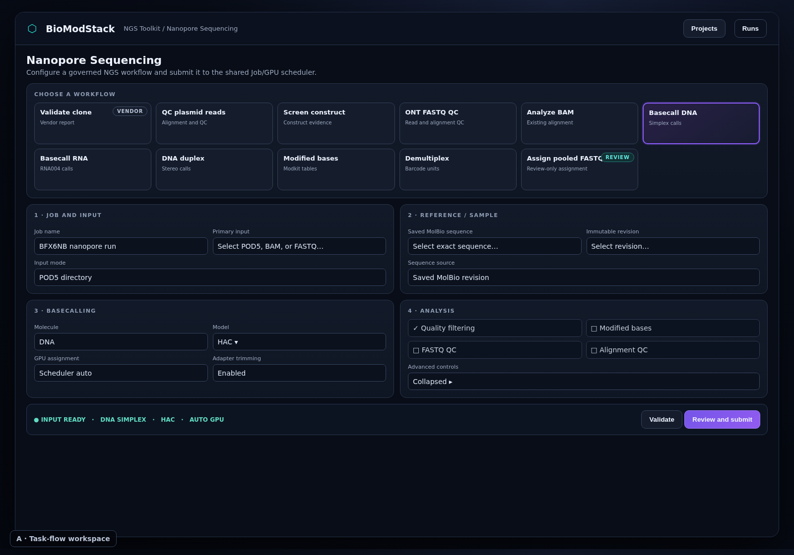
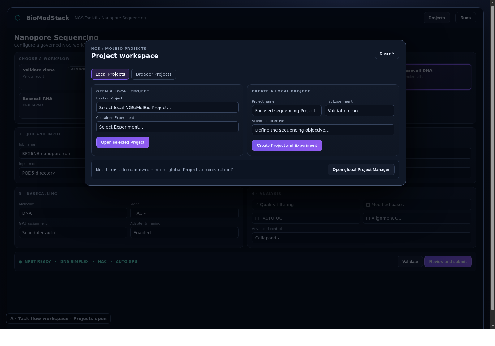

# NGS Toolkit Task-Flow UI Rework SOW

**Status:** Approved design, implementation specification
**Date:** 2026-08-21
**Target environment:** BioModStack Development
**Target branch:** `test`
**Baseline:** `e416df44d675fbeb01fc2c279362d9ff9e530023`
**Operator issues:** `BMS-DEV-24`, `BMS-DEV-25`, `BMS-DEV-26`, `BMS-DEV-27`

## 1. Goal

Rework the NGS Toolkit workflow menu and Nanopore configuration surface into the approved task-flow workspace. The result shall use horizontal space deliberately, keep all workflow choices discoverable, hide Project management until requested, and remove misleading or duplicate controls.

This work changes presentation and interaction structure. It shall preserve workflow selection, typed parameters, Job submission, Project ownership, query parameters, and scientific runtime behavior.

## 2. Approved visual design

The controlling design is the first approved render and its Project panel state.

### 2.1 Default task-flow workspace



- File: `docs/specs/assets/ngs-toolkit-task-flow-ui/task-flow-workspace.png`
- Size: 223,518 bytes
- SHA-256: `f895262a707a67351677c37dafe7a4aca92646336725dd58b00d0e903700f038`

### 2.2 Project panel open



- File: `docs/specs/assets/ngs-toolkit-task-flow-ui/project-panel-open.png`
- Size: 236,116 bytes
- SHA-256: `5e65c87cce4c8800cca0b4a381c144e248c40013a03a21e6dad6e69d11be3708`

The renders establish layout, density, grouping, selected-state hierarchy, and Project-panel behavior. Existing BioModStack design tokens remain authoritative for exact colors, typography, controls, spacing, and focus presentation.

## 3. Current problems

### 3.1 Misleading inactive card accents

`Validate a known plasmid / clone` and `Assign pooled FASTQ references` use the selected-state accent border while inactive. This makes three workflows appear selected.

Current source:

- `platform/frontend/src/components/NanoporeTemplate.tsx:1570`
- `platform/frontend/src/components/NanoporeTemplate.tsx:1580`
- Shared selected/inactive styling at `platform/frontend/src/components/NanoporeTemplate.tsx:1587`

### 3.2 Persistent oversized Project surface

`NgsMolBioProjectHub` renders its complete Project creation, selection, optional exposure, and Domain Experiment workspace before the NGS workflow surface.

Current source:

- `platform/frontend/src/App.tsx:98-103`
- `platform/frontend/src/components/molbio-ngs/NgsMolBioProjectHub.tsx:257-357`

### 3.3 Fragmented Nanopore form

The Nanopore form uses a 12-column grid, but independent cards have uneven spans and weak task grouping. The resulting rows contain dead space, mismatched heights, and controls that appear unrelated.

Current source starts at:

- `platform/frontend/src/components/NanoporeTemplate.tsx:1608`

### 3.4 Duplicate global Project navigation

Two controls navigate to `/projects` within the same NGS Project surface:

- `Open broader Project Manager` at `platform/frontend/src/components/molbio-ngs/NgsMolBioProjectHub.tsx:265`
- `Open Project Manager` at `platform/frontend/src/components/molbio-ngs/DomainExperimentWorkspace.tsx:891-896`

## 4. Scope

### 4.1 Included

1. Recompose the NGS Nanopore page into the approved task-flow workspace.
2. Normalize inactive workflow-card styling.
3. Add neutral semantic badges for special workflows.
4. Replace the persistent Project hub with one compact `Projects` launcher.
5. Present existing local and broader Project actions in one modal panel.
6. Remove duplicate global Project Manager navigation from the NGS surface.
7. Group Nanopore controls into four visible task sections.
8. Add a compact review/status bar before submission.
9. Preserve responsive behavior for desktop, tablet, and mobile widths.
10. Add mounted interaction and layout-contract tests.
11. Verify the result in canonical Development at the approved baseline or its reconciled successor.

### 4.2 Excluded

- API or database schema changes
- Project ownership semantic changes
- New workflow types
- Workflow launch-payload changes
- Scheduler or GPU-policy changes
- Scientific parameter changes
- New NGS analysis features
- NGS result-viewer changes
- Job history redesign
- MolBio Toolkit redesign outside shared Project-launcher integration
- Production deployment
- Changes to issues outside `BMS-DEV-24` through `BMS-DEV-27`

### 4.3 Remediation amendment

The operator directed a remediation review cycle until the identified gaps are filled. This amendment supersedes every conflicting exclusion or preservation clause in this document only for the following narrow authority chain:

1. visible NGS operator settings shall serialize into the submitted request;
2. API normalization and stage inference shall preserve those settings;
3. Construct Screening shall execute CloneValidation only when `run_assembly=true`;
4. workflow metadata shall declare conditional CloneValidation artifact kinds;
5. the supported single-GPU `pinned_gpu` field may be exposed and serialized through the existing request contract;
6. fresh requests shall reject the persisted-legacy-only `run_multimer_qc` key while historical reads retain compatibility;
7. Construct Screening assembly shall validate the same bounded `wf_clone_*` controls as Clone Validation;
8. Construct Screening shall use one canonical `wf_clone_validation` stage identity for planning, callbacks, persistence, and response inference, including FASTQ assembly;
9. mounted frontend tests and affected backend contract tests shall prove the chain.

The amendment permits changes only in the frontend payload helper/component, the existing ONT submit boundary, request normalizer and stage-response path, the Construct Screening workflow, the existing ONT workflow registry, its active Construct Screening parameter schema and digest-bound registry records, the exact runtime source denominator, the generated successor runtime-authority record required for managed Development admission, and their focused tests. It does not authorize new workflow families, database migrations, scheduler redesign, scientific computation, retry or result-provenance changes, or Production deployment.

Any finding outside this list remains a separately blocked scope deviation. On 2026-08-23, the operator explicitly authorized completion, integration into `test`, canonical Development activation, and live Tailnet acceptance. That authorization does not include Production promotion or scientific Job submission.

## 5. Information architecture

The default page shall use this order:

1. Page header
2. Workflow chooser
3. `Job and input` plus `Reference / sample`
4. `Basecalling` plus `Analysis`
5. Review/status bar
6. Submit action

Project management shall not consume inline page height while closed.

## 6. Workflow chooser contract

### 6.1 Inventory

The chooser shall retain all current workflow entries:

1. Validate a known plasmid / clone
2. QC plasmid reads
3. Screen a construct
4. ONT FASTQ QC
5. Analyze aligned plasmid BAM
6. Basecall DNA simplex
7. Basecall RNA
8. Basecall DNA duplex
9. Call modified bases
10. Classify and demultiplex RBK114
11. Assign pooled FASTQ references

Workflow selection and parameter compatibility shall continue to use the current `selectedWorkflow` and `selectWorkflow` behavior.

### 6.2 Card states

Each card shall have one of these closed visual states:

- `inactive`: neutral standard border, standard panel background, no ring
- `hover`: neutral hover background or border emphasis
- `focus-visible`: accessible keyboard focus treatment
- `selected`: one accent border, one accent tint, and one accent ring
- `disabled`, when applicable: reduced emphasis plus native disabled semantics

Only one card may expose `aria-pressed="true"` and selected styling.

### 6.3 Special-workflow badges

Special meaning shall use text badges rather than selected-state borders.

- `Validate a known plasmid / clone`: `VENDOR REPORT`
- `Assign pooled FASTQ references`: `REVIEW ONLY`

Badges shall use a neutral or secondary semantic treatment. A badge shall not make an inactive card look selected.

### 6.4 Desktop density

At viewport widths of 1280 pixels or more:

- Use up to six cards per row when the available content width permits.
- Keep card heights aligned within each row.
- Keep all eleven entries visible without a workflow dropdown.
- Avoid a card width below 180 CSS pixels.

At narrower widths, reduce the column count without horizontal scrolling.

## 7. Project launcher and panel contract

### 7.1 Closed state

The default page shall show one compact `Projects` button in the NGS page header.

The closed state shall not render visible Project forms, selectors, Domain Experiment details, or global Project navigation below the header.

Existing Project context may be summarized near the button with a short label or badge. The summary shall not expand into a second Project surface.

### 7.2 Open state

Clicking `Projects` shall open one modal dialog matching the approved Project-panel render.

The panel shall provide:

- `Local Projects` tab
- `Broader Projects` tab
- Existing local Project selection
- Contained Experiment selection
- Open selected Project action
- Local Project name
- First contained Experiment name
- Scientific objective
- Create local Project and Experiment action
- One `Open global Project Manager` action

Existing advanced Project and Experiment metadata shall remain available behind a progressive-disclosure control inside the panel. It shall not expand the closed page.

### 7.3 Existing semantics

The panel shall reuse the current queries, mutations, and context updates from `NgsMolBioProjectHub`.

It shall preserve:

- local standalone Project ownership
- broader Project-owned NGS/MolBio Experiment creation
- exact workspace and Experiment query parameters
- immutable state-revision selection
- governed links for exposing selected local Experiments and Results
- one-copy data ownership
- existing authorization and error handling

The visual rework shall not create a second Project implementation.

### 7.4 Dialog behavior

The panel shall:

- use an accessible dialog primitive or equivalent `role="dialog"` and `aria-modal="true"`
- have an accessible name
- move focus into the dialog when opened
- trap keyboard focus while open
- close with the explicit close control
- close with Escape unless an inner destructive confirmation owns Escape
- restore focus to the `Projects` launcher
- prevent background interaction while open
- preserve unsaved panel fields when switching between its local and broader tabs during one open session
- discard unsaved fields only after explicit close or successful mutation, according to existing form behavior

### 7.5 Global Project Manager action

Exactly one visible action on the NGS surface may navigate to `/projects`.

When the Project panel is closed, no second inline global Project Manager link shall appear in `DomainExperimentWorkspace`.

Incomplete-context notices shall explain the missing context and direct the user to the single `Projects` launcher. They shall not render another `/projects` link.

## 8. Task-flow form contract

### 8.1 Section 1: Job and input

This section owns:

- Job name
- GPU pinning or scheduler assignment control, when the selected workflow exposes it
- primary input selection
- input type or mode
- input validation state

### 8.2 Section 2: Reference / sample

This section owns controls that bind biological identity:

- saved MolBio sequence
- exact immutable MolBio revision
- shared Experiment reference
- direct sequence import when allowed
- pooled-reference controls when `pooledAssignment` is selected

Controls shall remain conditional on the selected workflow. Hidden controls shall not silently contribute stale values to submission.

### 8.3 Section 3: Basecalling

This section owns:

- molecule type
- Dorado/basecalling mode
- model selection
- adapter trimming
- GPU policy display or control
- other runtime settings that directly govern basecalling

### 8.4 Section 4: Analysis

This section owns:

- quality filtering
- modified-base analysis
- FASTQ QC
- alignment QC
- analysis-specific switches
- progressive disclosure for advanced controls

Advanced controls shall be collapsed by default. Critical scientific settings shall remain typed and accessible. Collapse shall hide only the visual controls, not alter their current persisted values.

### 8.5 Alignment and spacing

At desktop width:

- Sections 1 and 2 shall form one aligned two-column row.
- Sections 3 and 4 shall form a second aligned two-column row.
- Paired sections shall use equal available widths.
- Internal controls shall use consistent label, input, and vertical-spacing rules.
- Empty conditional regions shall not reserve large blank columns.
- Section heights may differ when conditional content requires it, but controls shall start from aligned top edges.

## 9. Review/status bar

A compact bar shall appear after the configuration sections.

It shall summarize current selected values without creating new authority:

- selected workflow
- input readiness
- molecule or input mode when applicable
- selected model when applicable
- GPU policy
- reference/revision readiness when required

The bar shall derive its values from the same typed state used for submission. It shall not maintain a second form state.

The existing submit validation remains authoritative. The bar may include `Validate` and `Review and submit` actions only when those actions call existing validation and submission paths.

## 10. Responsive behavior

### 10.1 Wide desktop: 1280 pixels and above

- Workflow chooser: up to six columns
- Task sections: two equal columns
- Project panel: centered modal with two primary columns
- No horizontal page scrolling

### 10.2 Tablet and small desktop: 768 to 1279 pixels

- Workflow chooser: two or three columns according to available width
- Task sections: one or two columns without control compression
- Project panel: width constrained to the viewport with internal vertical scrolling

### 10.3 Mobile: below 768 pixels

- Workflow chooser: one column
- Task sections: one column in required task order
- Project panel: full-height dialog or sheet
- Primary actions remain visible without horizontal scrolling
- Touch targets shall meet the existing BioModStack minimum target size

## 11. Accessibility

The implementation shall meet these requirements:

- Workflow cards remain native buttons.
- Selection uses `aria-pressed`.
- Special badges do not replace the card’s accessible name.
- Keyboard order follows visual task order.
- Section headings create a logical heading hierarchy.
- Modal focus behavior follows Section 7.4.
- Focus indicators remain visible against all backgrounds.
- Color is not the sole indicator of selected, review-only, required, invalid, or disabled state.
- Validation messages associate with their fields.
- Reduced-motion preferences disable nonessential panel and card animation.

## 12. State and non-regression requirements

The rework shall preserve:

- all eleven workflow selections
- initial workflow selection
- workflow-specific conditional controls
- `initialValues` hydration
- saved and cloned Job behavior
- URL query parameters
- local and broader Project context
- immutable sequence/revision requirements
- Project and Experiment mutations
- current launch payload keys and values, except the explicit §4.3 fresh-request authority changes
- runtime defaults, including workflow-selection defaults unless §4.3 explicitly changes one
- GPU pinning behavior
- Job creation and submission
- all current error states

Opening or closing the Project panel shall not:

- change the selected workflow
- clear NGS form fields
- mutate Project state
- launch a request that writes durable state
- navigate away from `/ngs`

## 13. Implementation boundaries

Expected files:

- Modify `platform/frontend/src/App.tsx`
- Modify `platform/frontend/src/components/NanoporeTemplate.tsx`
- Modify `platform/frontend/src/components/molbio-ngs/NgsMolBioProjectHub.tsx`
- Modify `platform/frontend/src/components/molbio-ngs/DomainExperimentWorkspace.tsx`
- Create or modify mounted Vitest files under `platform/frontend/tests/vitest/`
- Modify `platform/frontend/tests/nanoporeTemplateContract.test.ts`
- Modify `platform/frontend/tests/immutableNgsReferencePlane.test.ts` only to preserve immutable-reference authority under the new payload construction
- Create or modify `platform/frontend/tests/nanoporeSettingsContract.test.ts`
- Modify `platform/frontend/vitest.md.config.ts` only if a new mounted test file requires registration
- Modify `platform/api/services/ont_ngs_contract.py`
- Modify `platform/api/routers/jobs.py`
- Modify `platform/api/routers/ont_runs.py` only for the fresh-request legacy-key boundary
- Create or modify focused ONT NGS contract tests under `platform/api/tests/`
- Modify `workflows/ngs/ont_construct_screening.nf`

A small reusable Project-dialog component may be extracted under `platform/frontend/src/components/molbio-ngs/` when it prevents duplication. The existing Project query and mutation ownership shall remain in one source path.

No database schema, scheduler, retry, provenance, or non-Construct-Screening workflow file shall change.

## 14. Test requirements

### 14.1 Workflow chooser tests

Tests shall prove:

- all eleven workflows render
- only the selected card has selected styling
- only the selected card has `aria-pressed="true"`
- clone and pooled-assignment cards use neutral inactive borders
- `VENDOR REPORT` and `REVIEW ONLY` badges render
- selecting each card invokes the current workflow-selection path

A source-token assertion alone is insufficient for selected-state behavior. At least one mounted test shall inspect rendered classes and ARIA state.

### 14.2 Project panel tests

Mounted tests shall prove:

- the full Project editor is absent while closed
- one `Projects` launcher is visible
- clicking it opens one accessible dialog
- local and broader tabs are available
- one global Project Manager action exists while the dialog is open
- no duplicate `/projects` action exists
- Escape closes the dialog
- focus returns to the launcher
- opening and closing does not clear Nanopore form state
- no Project mutation runs merely from opening or closing

### 14.3 Task-flow tests

Tests shall prove:

- four task section headings render in order
- workflow-conditional controls remain conditional
- stale hidden values do not enter the submitted payload
- review/status values match current typed form state
- existing submission payload tests remain unchanged or receive layout-only fixture updates

### 14.4 Responsive and visual acceptance

Mounted/component tests shall verify responsive class contracts. Browser acceptance shall verify actual rendered behavior at:

- 1600 × 1200
- 1366 × 768
- 768 × 1024
- 390 × 844

Acceptance captures shall include:

- default page
- one selected workflow
- Project panel open
- advanced controls open
- mobile Project panel

## 15. Verification commands

Run from `platform/frontend` in the implementation worktree:

```bash
pnpm exec tsx --test tests/nanoporeTemplateContract.test.ts
pnpm exec vitest run --config vitest.md.config.ts <new-mounted-test-files>
pnpm exec tsc -b --pretty false
pnpm run build
pnpm test
```

Expected result:

- focused contract tests pass
- mounted interaction tests pass
- TypeScript passes
- production build passes
- full frontend suite introduces zero candidate-only failures

Run from the repository root:

```bash
git diff --check
```

Expected result: exit code 0.

## 16. Live Development acceptance

After authorized integration and deployment:

1. Prove canonical Development checkout and `origin/test` use the accepted SHA.
2. Prove Development API and frontend ownership.
3. Prove the live frontend serves the accepted source revision.
4. Open `/ngs` through the Development frontend.
5. Capture the default task-flow workspace.
6. Confirm clone and pooled assignment are neutral while inactive.
7. Select a different workflow and confirm one selected card.
8. Open and close the Project panel.
9. Confirm the persistent Project editor is absent while closed.
10. Confirm exactly one global Project Manager action exists.
11. Confirm the Nanopore form retains its state across Project-panel open and close.
12. Inspect desktop, tablet, and mobile viewport behavior.
13. Confirm no console error or failed frontend request occurs during these interactions.

Live acceptance shall not submit a scientific Job unless separately authorized.

## 17. Issue closure matrix

| Issue | Acceptance condition |
|---|---|
| `BMS-DEV-24` | Inactive clone and pooled-assignment cards use neutral borders; selected state is unique. |
| `BMS-DEV-25` | Project forms disappear from the default page; one launcher opens the approved Project panel. |
| `BMS-DEV-26` | The Nanopore form uses the approved four-section task-flow layout at desktop width and responsive stacking at narrower widths. |
| `BMS-DEV-27` | Exactly one global Project Manager action exists on the NGS surface. |

Issue statuses shall remain open until current live Development acceptance passes. Each cleared issue shall record the deployed SHA and a concise acceptance note.

## 18. Work packages

### WP1: Workflow-card truth

- Add mounted selected/inactive-state tests.
- Remove inactive accent-border tones.
- Add neutral semantic badges.
- Verify all workflow selections.

### WP2: Project panel extraction

- Add mounted closed/open dialog tests.
- Convert `NgsMolBioProjectHub` into a compact launcher plus dialog.
- Reuse current Project queries and mutations.
- Remove duplicate global Project Manager navigation.
- Verify focus, Escape, and state preservation.

### WP3: Task-flow layout

- Add section-order and conditional-control tests.
- Recompose `NanoporeTemplate` into the four approved sections.
- Add the derived review/status bar.
- Preserve submission state and payload behavior.

### WP4: Responsive and accessibility hardening

- Add responsive class and modal-contract tests.
- Validate keyboard and screen-reader semantics.
- Verify the four required viewport sizes.

### WP5: Integration and live acceptance

- Run the complete frontend denominator.
- Integrate only after explicit authorization.
- Deploy through the managed Development path.
- Prove source/runtime identity.
- Perform browser acceptance without scientific submission.
- Clear `BMS-DEV-24` through `BMS-DEV-27` only after live proof.

## 19. Definition of done

This specification is complete only when:

- the approved task-flow workspace is implemented
- the approved Project panel is implemented
- all four issue acceptance conditions pass
- all test and build gates pass
- canonical Development runs the accepted SHA
- current browser acceptance passes at all required viewports
- no scientific Job was launched during UI acceptance
- issue records include the accepted deployed SHA and are marked cleared

Source implementation alone does not close the issues. Live Development acceptance is required.
